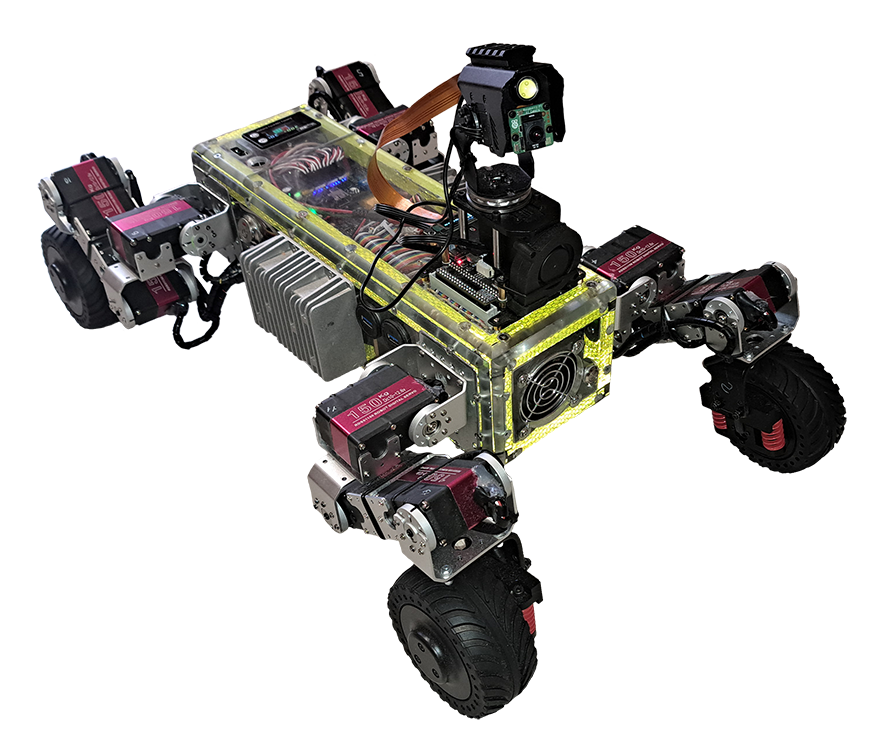
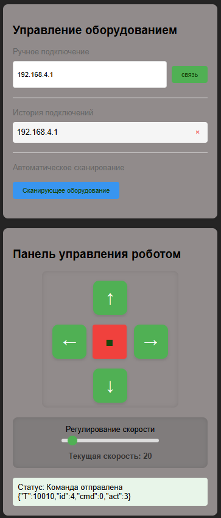
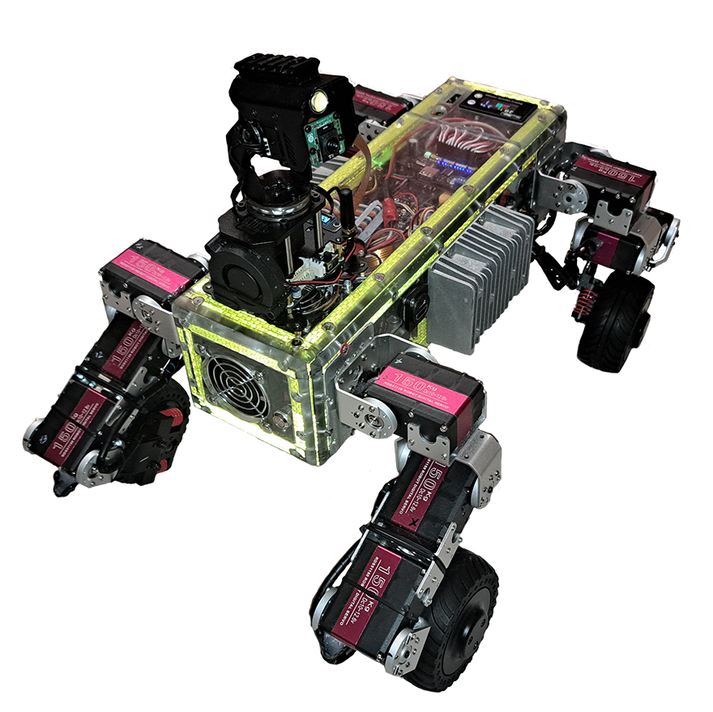

# DDSM_DRIVER_LAN

Управляйте шасси двигателя DDSM через локальную сеть

## 1. Функция и эффект

В настоящее время сканирование, подключение и управление шасси тележки могут осуществляться в рамках одной и той же локальной сети, которая открывается следующим образом：  Используйте кнопку направления движения и кнопку аварийной остановки, чтобы управлять движением, рулевым управлением и аварийной остановкой автомобиля。 Не зависит от компьютера JESTON и сети Helloworld。

## 2. Инструкция по применению

### 1. связь

В той же локальной сети сетью по умолчанию, установленной на плате драйвера DDSM, является Helloworld, которая поддерживает ввод ip-адресов для подключения устройств и сканирование для подключения устройств.。 В случае отключения сети плата драйвера DDSM предоставляет точку доступа AP с именем ESP32-AP и паролем 12345678..

### 2.дистанционное управление

Для управления пультом дистанционного управления используйте клавиши со стрелками. Рекомендуется не устанавливать слишком высокую скорость. Значение скорости по умолчанию, равное 20, является более подходящим значением.。

